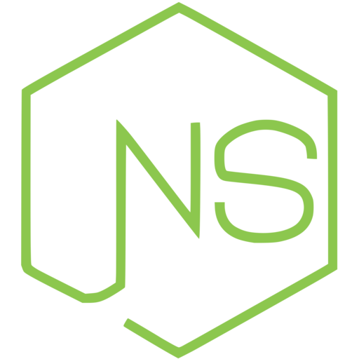
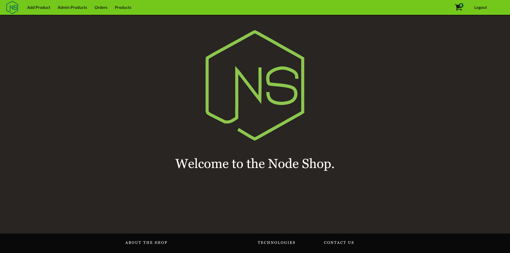
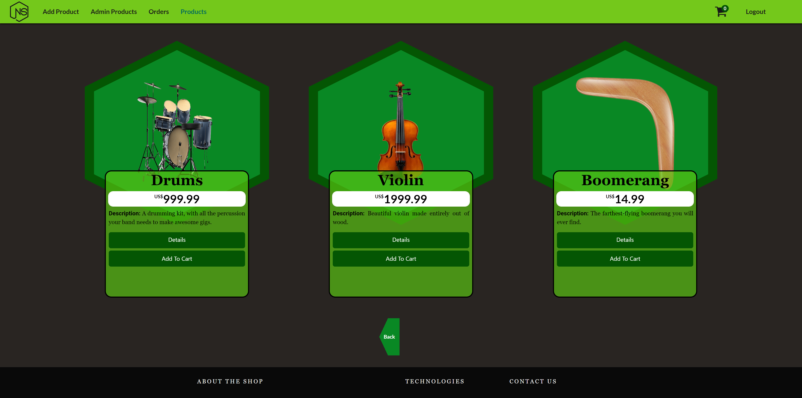

<h1 align="center">NodeShop - Uma loja online inspirada em Node.js, construída com ReactJS</h1>
<p align="center">
  
  <br>
  <i>Este site é um exemplo/demonstração do tipo de lojas online que podem ser construídas 
    <br>com a biblioteca ReactJS, quando acoplada a um Backend Node.js.</i>
  <br>
</p>

<p align="center">
  <a href="https://nothingnothings.github.io/NodeShopRestAPI"><strong>https://nothingnothings.github.io/NodeShopRestAPI</strong></a>
  <br>
</p>

## Introduction






Aplicação Frontend de Página Única (SPA) construída com a biblioteca ReactJS (create-react-app). O design do site, inspirado em hexágonos, foi baseado no [logo do Node.js](https://nodejs.org/static/images/logos/nodejs-new-pantone-black.svg). Flexbox e media queries foram utilizados para o design responsivo (tentando atender a múltiplos tipos de dispositivos, tanto desktop quanto mobile, com diferentes resoluções). De acordo com as últimas versões do React, o app foi feito a partir de componentes funcionais, afastando-se da abordagem baseada em classes ("`class App extends React.Component{}`") usada no passado.


O App foi inicializado com `create-react-app` e implantado com o GitHub Pages, assistido pela funcionalidade GitHub Actions. Este app também está disponível como um app "multi-página", sem ReactJS. O projeto pode ser encontrado [aqui](https://nodeshop-br-ejs.herokuapp.com/).

O backend do app, como o nome sugere, utiliza Node.js (com o framework Express.js) e está hospedado na plataforma Heroku. O código do lado do servidor pode ser encontrado [aqui](https://github.com/nothingnothings/NodeShopRestAPIBackend).


[](https://github.com/nothingnothings/NodeShopRestAPI)
[](https://github.com/nothingnothings/NodeShopRestAPI/blob/master/README.pt-br.md)


 
## Tecnologias
 
 Algumas das linguagens e libraries empregadas:
 
 - Node Package Manager (para inicializar e gerenciar o app React)
 - HTML5 (JSX)
 - CSS3 (animações, Flexbox, media queries)
 - ReactJS (Biblioteca JavaScript, app construído inteiramente com componentes React)
 - React Router (para a navegação entre as diferentes "páginas" do app)
 - Abordagem React Redux para gerenciamento de estado (estado global dividido entre 4 reducers: `auth`, `orders`, `cart` e `shop`)
 - Bootstrap (principalmente para partes do componente Footer)
 - MongoDB (solução de armazenamento de banco de dados noSQL; armazenamento de objetos `user`, `product` e `order` em coleções em um banco de dados MongoDB Atlas remoto)
 - Font Awesome
 - Axios (para a comunicação, requisições e respostas, entre o app frontend e o backend Node.js/express.js que ele visa)

 
 
 
## Estrutura de Diretórios do Projeto

O ambiente de desenvolvimento (com o uso da ferramenta/workflow `create-react-app`):


```

.\
│
├── public\
│   │
│   ├── images\
│   │   ├── 1658431838529-Bike.png
│   │   ├── 1658432590831-Boat.png
│   │   ├── 1658433107407-Pencil.png
│   │   ├── 1658433305838-Skateboard.png
│   │   ├── 1658433495040-keyboard.png
│   │   ├── 1658434189280-A set of tires.png
│   │   ├── 1658434649972-Boomerang.png
│   │   ├── 1658435067043-Drums.png
│   │   └── 1658435608982-Violin.png
│   │
│   ├── 404.html
│   ├── NodeShopBlack.png
│   ├── apple-touch-icon.png
│   ├── browserconfig.xml
│   ├── favicon-16x16.png
│   ├── favicon-32x32.png
│   ├── favicon.ico
│   ├── index.html
│   ├── logo192.png
│   ├── logo512.png
│   ├── manifest.json
│   ├── mstile-150x150.png
│   └── site.webmanifest
│
├── src\
│   │
│   ├── components\
│   │   │
│   │   ├── Backdrop\
│   │   │   ├── Backdrop.css
│   │   │   └── Backdrop.js
│   │   │
│   │   ├── Cart\
│   │   │   │
│   │   │   ├── CartItemList\
│   │   │   │   │
│   │   │   │   ├── CartItem\
│   │   │   │   │   ├── CartItem.css
│   │   │   │   │   └── CartItem.js
│   │   │   │   │
│   │   │   │   ├── CartItemList.css
│   │   │   │   └── CartItemList.js
│   │   │   │
│   │   │   ├── NoProduct\
│   │   │   │   ├── NoProduct.css
│   │   │   │   └── NoProduct.js
│   │   │   │
│   │   │   ├── Cart.css
│   │   │   └── Cart.js
│   │   │
│   │   ├── Footer\
│   │   │   ├── Footer.css
│   │   │   └── Footer.js
│   │   │
│   │   ├── Grid\
│   │   │   ├── Grid.css
│   │   │   └── Grid.js
│   │   │
│   │   ├── Navigation\
│   │   │   │
│   │   │   ├── MainNavigation\
│   │   │   │   ├── MainNavigation.css
│   │   │   │   └── MainNavigation.js
│   │   │   │
│   │   │   ├── MobileNavigation\
│   │   │   │   ├── MobileNavigation.css
│   │   │   │   └── MobileNavigation.js
│   │   │   │
│   │   │   ├── NavigationItems\
│   │   │   │   │
│   │   │   │   ├── NavigationItem\
│   │   │   │   │   ├── NavigationItem.css
│   │   │   │   │   └── NavigationItem.js
│   │   │   │   │
│   │   │   │   ├── NavigationItems.css
│   │   │   │   └── NavigationItems.js
│   │   │   │
│   │   │   └── SideDrawer\
│   │   │       │
│   │   │       └── DrawerToggle\
│   │   │           ├── DrawerToggle.css
│   │   │           └── DrawerToggle.js
│   │   │
│   │   │
│   │   │
│   │   ├── OrderBoard\
│   │   │   │
│   │   │   ├── Orders\
│   │   │   │   │
│   │   │   │   ├── OrdersItem\
│   │   │   │   │   ├── OrdersItem.css
│   │   │   │   │   └── OrdersItem.js
│   │   │   │   │
│   │   │   │   ├── Orders.css
│   │   │   │   └── Orders.js
│   │   │   │
│   │   │   ├── OrderBoard.css
│   │   │   └── OrderBoard.js
│   │   │
│   │   ├── Pagination\
│   │   │   ├── Pagination.css
│   │   │   └── Pagination.js
│   │   │
│   │   ├── ProductItem\
│   │   │   │
│   │   │   ├── Hexagon\
│   │   │   │   ├── Hexagon.css
│   │   │   │   └── Hexagon.js
│   │   │   │
│   │   │   ├── ProductBox\
│   │   │   │   ├── ProductBox.css
│   │   │   │   └── ProductBox.js
│   │   │   │
│   │   │   ├── ProductItem.css
│   │   │   └── ProductItem.js
│   │   │
│   │   ├── ProductList\
│   │   │   ├── ProductList.css
│   │   │   └── ProductList.js
│   │   │
│   │   ├── Toolbar\
│   │   │   ├── Toolbar.css
│   │   │   └── Toolbar.js
│   │   │
│   │   ├── UI\
│   │   │   │
│   │   │   ├── Button\
│   │   │   │   ├── Button.css
│   │   │   │   └── Button.js
│   │   │   │
│   │   │   ├── Input\
│   │   │   │   ├── Input.css
│   │   │   │   └── Input.js
│   │   │   │
│   │   │   └── Spinner\
│   │   │       ├── Spinner.css
│   │   │       └── Spinner.js
│   │   │
│   │   │
│   │   └── Wrapper\
│   │       ├── Wrapper.css
│   │       └── Wrapper.js
│   │
│   │
│   ├── hoc\
│   │   │
│   │   ├── Auxiliary\
│   │   │   └── Auxiliary.js
│   │   │
│   │   ├── Layout\
│   │   │   ├── Layout.css
│   │   │   └── Layout.js
│   │   │
│   │   └── ScrollToTop\
│   │       └── ScrollToTop.js
│   │
│   │
│   ├── pages\
│   │   │
│   │   ├── Admin-Shop\
│   │   │   ├── Admin-Shop.css
│   │   │   └── AdminShop.js
│   │   │
│   │   ├── Auth\
│   │   │   │
│   │   │   ├── Logout\
│   │   │   │   └── Logout.js
│   │   │   │
│   │   │   ├── Auth.css
│   │   │   └── Auth.js
│   │   │
│   │   ├── Cart\
│   │   │   ├── Cart.css
│   │   │   └── Cart.js
│   │   │
│   │   ├── Checkout\
│   │   │   ├── Checkout.css
│   │   │   └── Checkout.js
│   │   │
│   │   ├── Landing-Page\
│   │   │   ├── Landing-Page.css
│   │   │   └── Landing-Page.js
│   │   │
│   │   ├── Orders\
│   │   │   ├── Orders.css
│   │   │   └── Orders.js
│   │   │
│   │   ├── Product-Detail\
│   │   │   ├── ProductDetail.css
│   │   │   └── ProductDetail.js
│   │   │
│   │   ├── ProductEditor\
│   │   │   ├── ProductEditor.css
│   │   │   └── ProductEditor.js
│   │   │
│   │   └── Shop\
│   │       ├── Shop.css
│   │       └── Shop.js
│   │
│   │
│   ├── shared\
│   │   └── util.js
│   │
│   ├── store\
│   │   │
│   │   ├── actions\
│   │   │   ├── auth.js
│   │   │   ├── authActionTypes.js
│   │   │   ├── cart.js
│   │   │   ├── cartActionTypes.js
│   │   │   ├── order.js
│   │   │   ├── orderActionTypes.js
│   │   │   ├── shop.js
│   │   │   └── shopActionTypes.js
│   │   │
│   │   └── reducers\
│   │       ├── authReducer.js
│   │       ├── cartReducer.js
│   │       ├── orderReducer.js
│   │       └── shopReducer.js
│   │
│   │
│   ├── App.js
│   ├── axios-orders.js
│   ├── index.css
│   └── index.js
│
├── .gitignore
├── README.md
├── package-lock.json
└── package.json
```


O output do workflow `create-react-app`, conforme o visto na branch `gh-pages` (responsável pela implantação do app):


```
.\
│
├── images\
│   ├── 1658431838529-Bike.png
│   ├── 1658432590831-Boat.png
│   ├── 1658433107407-Pencil.png
│   ├── 1658433305838-Skateboard.png
│   ├── 1658433495040-keyboard.png
│   ├── 1658434189280-A set of tires.png
│   ├── 1658434649972-Boomerang.png
│   ├── 1658435067043-Drums.png
│   └── 1658435608982-Violin.png
│
├── static\
│   │
│   ├── css\
│   │   ├── main.fa8e2a93.css
│   │   └── main.fa8e2a93.css.map
│   │
│   └── js\
│       ├── main.4e33800d.js
│       ├── main.4e33800d.js.LICENSE.txt
│       └── main.4e33800d.js.map
│
├── .nojekyll
├── 404.html
├── NodeShopBlack.png
├── apple-touch-icon.png
├── asset-manifest.json
├── browserconfig.xml
├── favicon-16x16.png
├── favicon-32x32.png
├── favicon.ico
├── index.html
├── logo192.png
├── logo512.png
├── manifest.json
├── mstile-150x150.png
└── site.webmanifest
```


## Arquivos de Configuração do Projeto (package.json)

O arquivo package.json usado no projeto:

```
{
  "name": "node-shop-rest-api",
  "version": "0.2.0",
  "private": true,
  "homepage": "https://nothingnothings.github.io/NodeShopRestAPI",
  "dependencies": {
    "@fortawesome/free-regular-svg-icons": "^6.1.2",
    "@fortawesome/free-solid-svg-icons": "^6.1.2",
    "@fortawesome/react-fontawesome": "^0.2.0",
    "@reduxjs/toolkit": "^1.8.3",
    "@testing-library/jest-dom": "^5.16.4",
    "@testing-library/react": "^13.3.0",
    "@testing-library/user-event": "^13.5.0",
    "@types/react-fontawesome": "^1.6.5",
    "axios": "^0.27.2",
    "bootstrap": "^5.2.0",
    "font-awesome": "^4.7.0",
    "react": "^18.2.0",
    "react-bootstrap": "^2.4.0",
    "react-dom": "^18.2.0",
    "react-redux": "^8.0.2",
    "react-router-dom": "^6.3.0",
    "react-scripts": "5.0.1",
    "react-stripe-checkout": "^2.6.3",
    "redux": "^4.2.0",
    "redux-thunk": "^2.4.1",
    "web-vitals": "^2.1.4"
  },
  "scripts": {
    "start": "react-scripts start",
    "build": "react-scripts build",
    "test": "react-scripts test",
    "eject": "react-scripts eject"
  },
  "eslintConfig": {
    "extends": [
      "react-app",
      "react-app/jest"
    ]
  },
  "browserslist": {
    "production": [
      ">0.2%",
      "not dead",
      "not op_mini all"
    ],
    "development": [
      "last 1 chrome version",
      "last 1 firefox version",
      "last 1 safari version"
    ]
  },
  "devDependencies": {
    "@types/react": "^18.0.15",
    "gh-pages": "^4.0.0"
  }
}
```

## Configuração


Para usar este projeto, clone-o usando o Git:


1. Execute `git clone` para clonar o projeto em seu repositório local do Git.
2. Execute `npm install` para instalar todas as dependências (react, axios, etc.).
3. Execute `npm run build` para criar a versão de produção/implantação do app (output em `/build`).
4. Sirva os arquivos de produção localmente ou na web, com a ajuda de um provedor de hospedagem (embora grande parte do app dependa dos dados do backend, que neste caso da demonstração, é servido por um servidor Node.js (Express.js), hospedado no Heroku).
5. Para fins desta demonstração, na página "Get Started" (Autenticação), insira as credenciais `exemplo@exemplo.com` (email) and `exemplo` (password) para acessar os diversos recursos do app.


## Funcionalidades

- Aplicativo de Página Única, sem recarregamentos de página, um único arquivo HTML (ReactJS).
- Aplicativo dividido em muitos componentes, dos quais alguns são usados mais de uma vez, em diferentes páginas (filosofia de design do ReactJS).
- Design inspirado em hexágonos, criado com CSS.
- Logo SVG animado em CSS na página inicial.
- Lógica de validação de formulários usando o Hook `useState`, conforme visto nas páginas "Get Started" e "Add a Product".
- Design responsivo (adaptável, suporte a dispositivos móveis e desktop) criado com Flexbox e media queries.
- Uso de GitHub Actions e GitHub Pages com a ferramenta `create-react-app` para um fluxo de trabalho contínuo (transição da fase de desenvolvimento para a fase de produção/implantação). Ao executar o comando git push, o GitHub Actions transfere o conteúdo da branch master para a branch gh-pages, que então implanta o app em https://nothingnothings.github.io/NodeShopRestAPI/.
- Para fins de demonstração da implantação, apenas um único usuário é habilitado/criado no lado do servidor, com as credenciais `exemplo@exemplo.com` (campo de e-mail) e `exemplo` (campo de senha). A criação de usuários adicionais ("No account? Join NodeShop") é possível no app completo (neste app de demonstração, os endpoints de criação de contas estão desativados). Além disso, os "Pedidos" feitos pelo usuário são redefinidos a cada 60 minutos (recurso de Time to Live Index do MongoDB), e os produtos adicionados ao "Carrinho" a cada 8 horas (recurso "Scheduled Trigger" do MongoDB).
- Funcionalidade de "Carrinho de Compras" ("Adicionar" e "Remover" produtos, com ícone interativo "número de itens", sincronizado com o estado global do Redux), implementada com `react-redux`.
- Lógica de validação de formulários, implementada pela gestão de estado do ReactJS, na página "Get Started".
- Lógica de paginação simples para a lista de produtos.
- Redirecionamento de página, possibilitado pelo uso do React Router.
- Uso de Axios para comunicação com o backend Node.js (Express.js), que gerencia os objetos "Usuário", "Produto", "Pedido" e "Carrinho", armazenados em um banco de dados MongoDB (serviço MongoDB Atlas); o servidor Node.js e o banco de dados MongoDB também lidam com a lógica de autenticação (login/cadastro) implementada no app.
- Representação fictícia da possível integração de apps de lojas com Stripe, com o pacote `react-stripe-checkout` e lógica correspondente no lado do servidor, produzindo efeitos na interface do usuário (redirecionamento de página e atualização visual da página de "pedidos").
- Spinner "Loading..." personalizado e animado.
- Visualização das faturas de cada pedido em arquivos .pdf, produzidos pelo backend (pacote `pdfkit`).
- Uso do Font Awesome e Bootstrap (no componente Footer).
- Favicon personalizado, compatível com vários dispositivos.


## Inspiração

Este app foi baseado nas aplicações vistas nos cursos "NodeJS - The Complete Guide (MVC, REST APIs, GraphQL, Deno)" e "React - The Complete Guide (incl Hooks, React Router, Redux)" de Maximilian Schwarzmüller.
